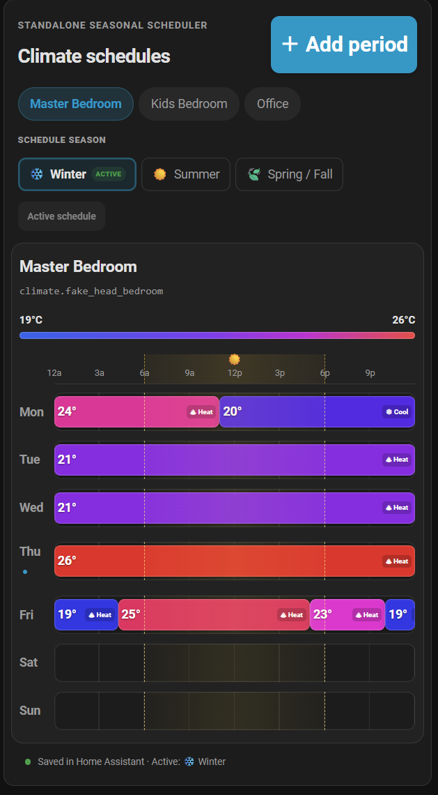

# Climate Schedule

[](https://my.home-assistant.io/redirect/hacs_repository/?owner=matt-blackstone&repository=ha-climate-schedule&category=integration)

A standalone Home Assistant custom integration and dashboard card for persistent,
seasonal climate schedules.



Any `climate.*` entity can be scheduled, including native Home Assistant climate
entities and entities supplied by other custom integrations.

## Requirements

- Home Assistant 2024.7 or newer
- An administrator account to create schedules and add the Lovelace resource
- One or more climate entities that advertise the HVAC modes you intend to use

No specific thermostat brand is required. Periods are only dispatched when their
HVAC mode is supported by the target entity.

## Features

- Winter, Summer, and Spring / Fall weekly schedules
- A separately selected active season exposed as a native Home Assistant select entity
- Per-period target temperature and HVAC mode
- Card-level editable temperature color gradient
- Click an empty gap to select its entire duration
- Drag either period edge in 15-minute increments
- Persistent Home Assistant storage with revision conflict protection
- Background execution while no dashboard is open
- Services for automations and manual re-application

A scheduled period is applied when it becomes active, when its current values are
edited, when the active season changes, or when Home Assistant starts. The
integration does not continuously reassert a setpoint during the period, so a
manual thermostat adjustment remains in effect until the next schedule boundary.

## Installation

### HACS custom repository

1. In HACS, open **Integrations**, then the three-dot menu, and choose
   **Custom repositories**.
2. Add `https://github.com/matt-blackstone/ha-climate-schedule` and select the
   **Integration** category.
3. Download **Climate Schedule** and restart Home Assistant.

The badge above opens this repository directly in HACS once it is public.
Until the project is accepted into HACS's default catalogue, it remains fully
installable as a custom repository.

### Manual

Copy this repository's integration folder:

```text
custom_components/climate_schedule
```

to this standard Home Assistant path:

```text
/config/custom_components/climate_schedule
```

Then restart Home Assistant.

## Home Assistant setup

1. Restart Home Assistant after installing or updating the files.
2. Go to **Settings → Devices & services → Add integration**.
3. Search for **Climate Schedule** and confirm setup.
4. Go to **Settings → Dashboards → Resources** and add:
   - URL: `/climate_schedule/climate-schedule-card.js`
   - Resource type: **JavaScript Module**
5. Add the card in YAML mode:

```yaml
type: custom:climate-schedule-card
title: Climate schedules
eyebrow: Seasonal thermostat schedules
default_season: winter
entities:
  - entity: climate.master_bedroom
    name: Master Bedroom
  - entity: climate.kids_bedroom
    name: Kids Bedroom
  - entity: climate.office
    name: Office
```

## Active season entity

The integration creates:

```text
select.climate_schedule_active_season
```

Its options are **Winter**, **Summer**, and **Spring / Fall**. Changing this
entity from a dashboard or an automation immediately activates and applies that
season. Changes made by the schedule card or the integration's service action
are reflected back to the select entity.

**Shoulder season** is the HVAC term for the spring/autumn transition between
heating and cooling. The card and select intentionally use the friendlier
**Spring / Fall** label. Services and automations use stable, non-localized
`season_id` values so they do not depend on a display label.

| Card and select label | Service or automation `season_id` |
| --- | --- |
| Winter | `winter` |
| Spring / Fall | `shoulder` |
| Summer | `summer` |

For example:

```yaml
action: select.select_option
target:
  entity_id: select.climate_schedule_active_season
data:
  option: Spring / Fall
```

### Seasonal automation example

This example reacts when a rolling average of overnight outdoor lows changes;
it does not override a season selected by the user at Home Assistant startup.
`sensor.outdoor_7_day_average_low` is intended to be a Home Assistant
**Statistics** helper based on an outdoor-temperature entity. Replace it with
your helper's entity ID. The values shown are in °F: under 45 selects
**Winter**, 45–59 selects **Spring / Fall**, and 60 or above selects
**Summer**. Adjust the thresholds for your climate.

```yaml
alias: Set Climate Schedule season from outdoor average low
description: Selects the active season from a rolling outdoor low-temperature sensor.
trigger:
  - platform: state
    entity_id: sensor.outdoor_7_day_average_low
action:
  - if:
      - condition: state
        entity_id: sensor.outdoor_7_day_average_low
        state:
          - unknown
          - unavailable
    then:
      - stop: Outdoor average low is not available
  - choose:
      - conditions:
          - condition: numeric_state
            entity_id: sensor.outdoor_7_day_average_low
            below: 45
        sequence:
          - action: climate_schedule.set_active_season
            data:
              season_id: winter
      - conditions:
          - condition: numeric_state
            entity_id: sensor.outdoor_7_day_average_low
            below: 60
        sequence:
          - action: climate_schedule.set_active_season
            data:
              season_id: shoulder
    default:
      - action: climate_schedule.set_active_season
        data:
          season_id: summer
mode: single
```

## Services

### `climate_schedule.set_active_season`

Selects and immediately applies the stable `season_id` values shown in the
table above.

```yaml
action: climate_schedule.set_active_season
data:
  season_id: summer
```

### `climate_schedule.apply_now`

Immediately reapplies every entity's currently active period.

```yaml
action: climate_schedule.apply_now
```

## Data and execution behavior

Schedules are stored by Home Assistant in
`/config/.storage/climate_schedule`. Do not edit that file while Home Assistant
is running.

A gap means “make no change.” Use an explicit period with HVAC mode **Off** when
the schedule should turn a climate entity off.

The card filters its HVAC mode choices using each entity's advertised
`hvac_modes`. If an entity later stops supporting a stored mode, the executor
logs a warning and skips that period instead of dispatching an invalid command.

## Troubleshooting

- **Climate Schedule does not appear in Add integration:** confirm the files are
  installed at `/config/custom_components/climate_schedule`, restart Home
  Assistant, and reload the browser page.
- **The card type is not found:** confirm the JavaScript module resource uses
  `/climate_schedule/climate-schedule-card.js`, then hard-refresh the browser.
- **A period does not run:** make sure it belongs to the active season, covers
  the current local time, and requests an HVAC mode advertised by the climate
  entity. The Home Assistant log records skipped unsupported modes.

## Releases and support

See [RELEASING.md](RELEASING.md) for the maintainer release process. Please use
the repository's GitHub issue tracker for bugs and feature requests once the
